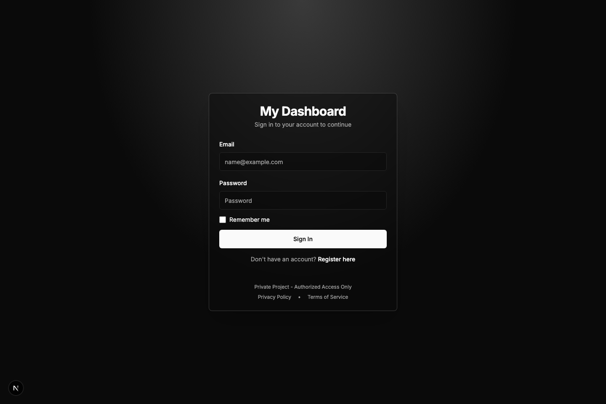
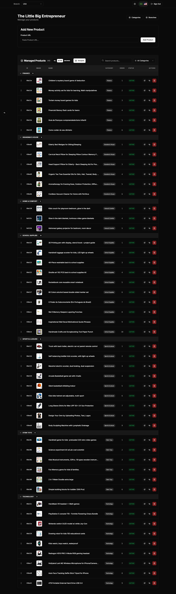
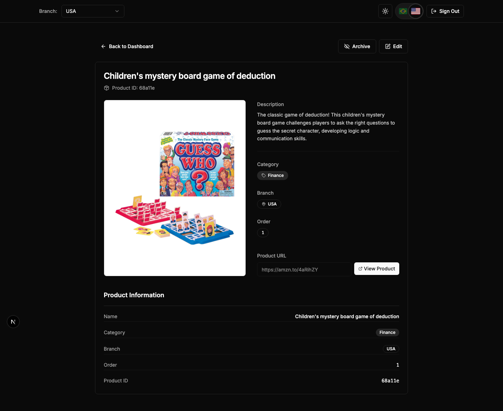
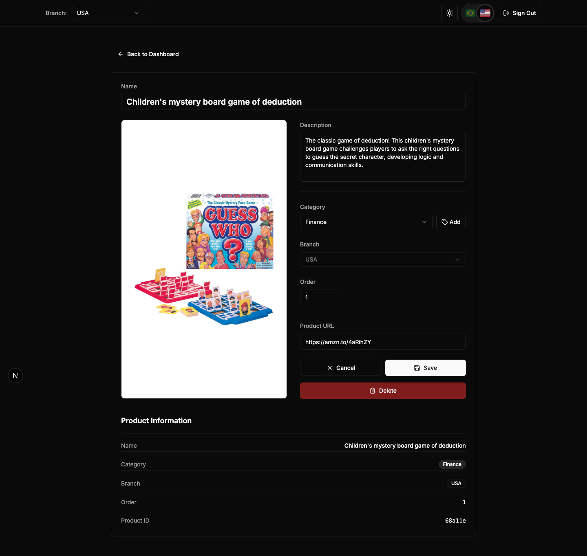
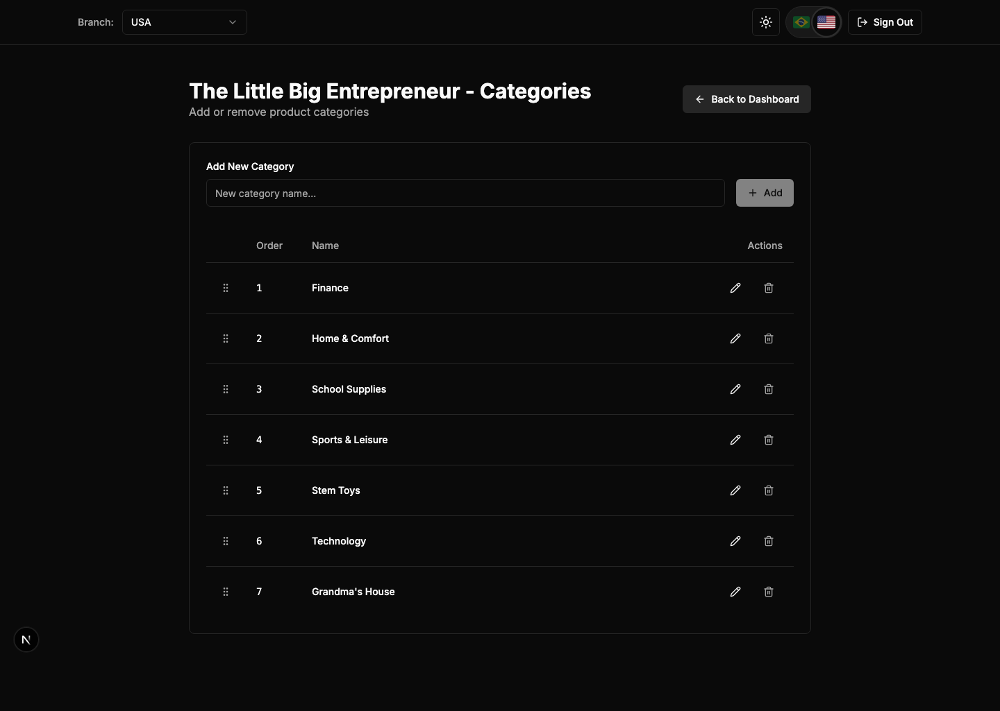
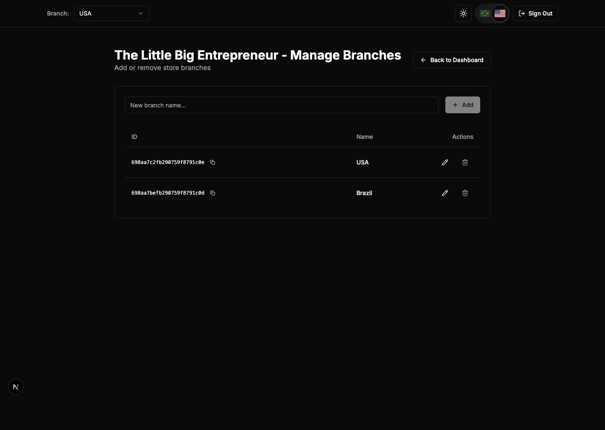

# Portfolio Demo Walkthrough

This folder contains a reproducible product demo for Store Product Automator, the admin tool used to curate products for https://www.thelittlebigentrepreneur.com/.

## Demo Video

- Full captured run: [store-automator-demo.webm](./store-automator-demo.webm)

## Demo Story

### 1. Secure Login

The demo starts on the credentials-based sign-in screen used to protect the admin workflow.



### 2. Loaded Dashboard

After authentication, the dashboard waits for the store context, branches, and product list to finish loading before capture. This is the main catalog-management workspace.



### 3. Product Detail View

The demo opens a real product detail page from the dashboard so reviewers can see the editing surface used for product metadata, categorization, branch assignment, and outbound source URLs.



### 4. Product Edit Mode

The flow then enters edit mode without saving changes, showing the safe, non-destructive editing experience.



### 5. Category Management

The categories screen demonstrates how the admin organizes products into curated groups.



### 6. Branch Management

The branches screen shows how the same catalog can be segmented across store branches or locales.



## What This Demonstrates

- Authenticated admin access
- Loaded dashboard state with real catalog data
- Product-detail and edit flows
- Category management
- Branch management
- End-to-end browser automation with Playwright video capture

## Regenerate The Demo

Run:

```bash
npm run demo
```

That command will refresh the screenshots and recreate the WebM video in this folder.